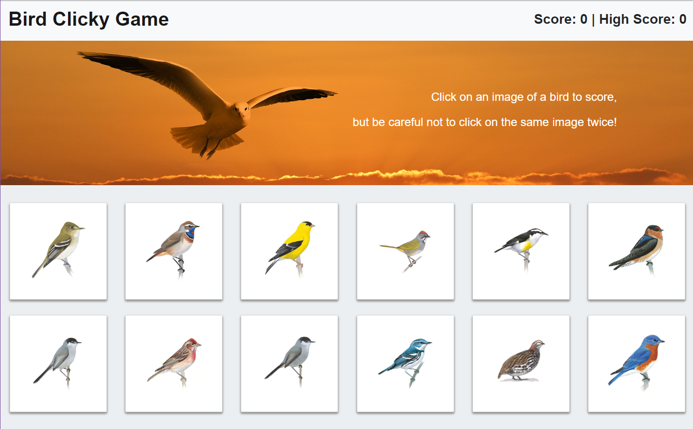

## Bird Clicky Game

This app was created with React. 

The object of the game is to click is to test your memory. The player can just click on each bird just once. If you click on the same bird twice, the score will reset to 0.

This project was created with [Create React App](https://github.com/facebookincubator/create-react-app).

- The application renders 12 different images of birds to the display.
- Once a player clicks on an image: 
  - The program checks to make sure the image hasn't been previously clicked. 
  - Once it's determined it was a good click, the score is updated and 
  - The images are shuffled.

Technologies used:
- HTML
- CSS
- React
- Javascript
- Bootstrap 4

